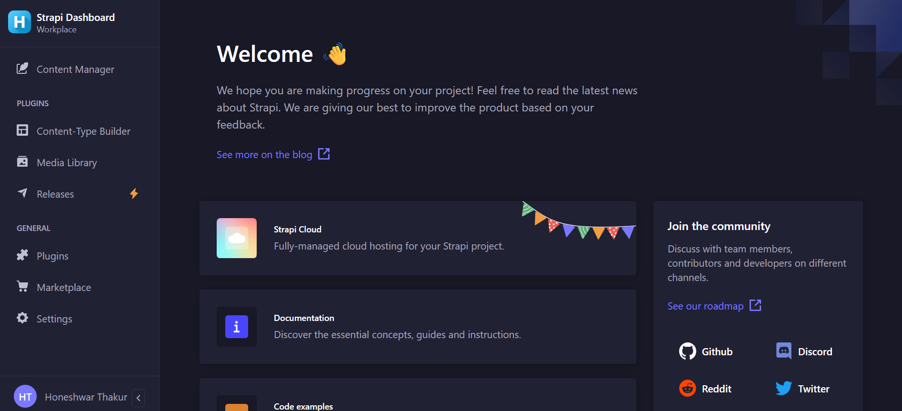
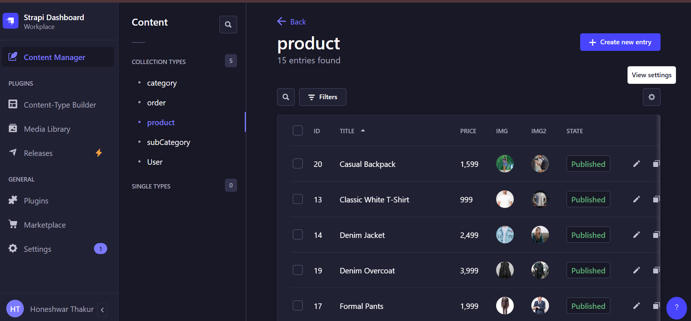
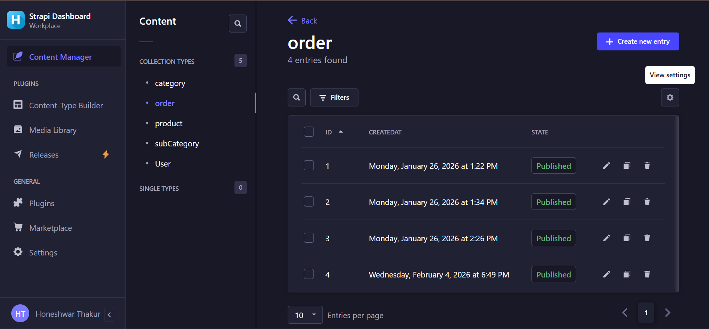
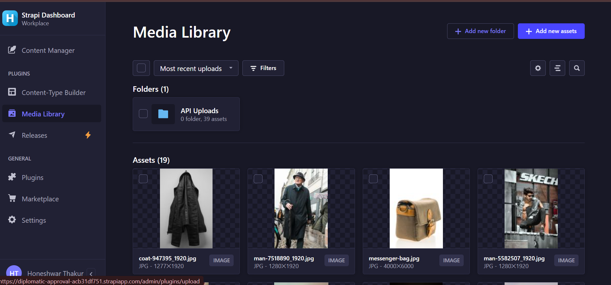

# 🛒 E-Commerce CMS (Strapi)

**E-Commerce CMS** is a robust and scalable **headless CMS** built with **Strapi v4** and **Node.js**.
It powers the backend of an e-commerce platform, enabling complete management of products, categories, orders, users, and media through a secure and intuitive admin panel.

Designed to work seamlessly with modern frontends like **Next.js** and **React**, this CMS provides clean REST APIs and role-based access control.

🔗 **Admin Panel:**
[https://diplomatic-approval-acb31df751.strapiapp.com/admin](https://diplomatic-approval-acb31df751.strapiapp.com/admin)

🔗 **APIs Integrated React Application:**
[https://honeshwar-store.netlify.app/](https://honeshwar-store.netlify.app/)


## 📸 Screenshot

<p align="center">
  
</p>
<p align="center">
  
</p>
<p align="center">
  
</p>
<p align="center">
  
</p>


## 🚀 Features

* 🗂 Category & Sub-Category Management
* 🛍 Product Management (price, stock, images, description)
* 📦 Orders Management
* 👤 Admin User & Role Management
* 🔐 Authentication & Permissions
* ☁️ Media Uploads (Cloudinary)
* 💳 Stripe-ready backend
* ⚡ REST APIs for frontend integration
* 🧠 Scalable headless architecture


## 🛠 Tech Stack

* **Strapi v4**
* **Node.js**
* **PostgreSQL**
* **Cloudinary** (Media uploads)
* **Stripe** (Payments)
* **JWT Authentication**
* **Role-Based Access Control**
* **REST APIs**


## 📁 CMS Modules

* Categories
* Sub-Categories
* Products
* Orders
* Admin Users & Roles
* Media Library


## 🚀 Getting Started (Local Setup)

```bash
git clone https://github.com/Honeshwar/my-strapi-project.git
cd my-strapi-project
npm install
npm run develop
```

Admin Panel:

```
http://localhost:1337/admin
```


## ⚙️ Environment Variables

Create a `.env` file in the root directory:

```env
DATABASE_CLIENT=postgres
DATABASE_NAME=your_db_name
DATABASE_USERNAME=your_db_user
DATABASE_PASSWORD=your_db_password

CLOUDINARY_NAME=xxxx
CLOUDINARY_API_KEY=xxxx
CLOUDINARY_API_SECRET=xxxx

STRIPE_SECRET_KEY=sk_test_xxxx
```


## 🔗 API Integration

This CMS exposes REST APIs that can be consumed by:

* Next.js Frontend
* React Applications
* Mobile Apps
* Any Headless Commerce Client

🔗 **APIs Integrated React Application:**
[https://honeshwar-store.netlify.app/](https://honeshwar-store.netlify.app/)